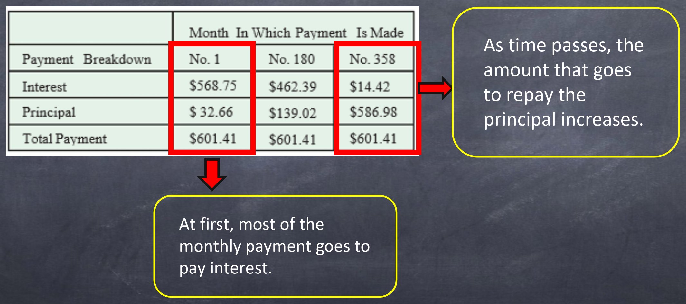
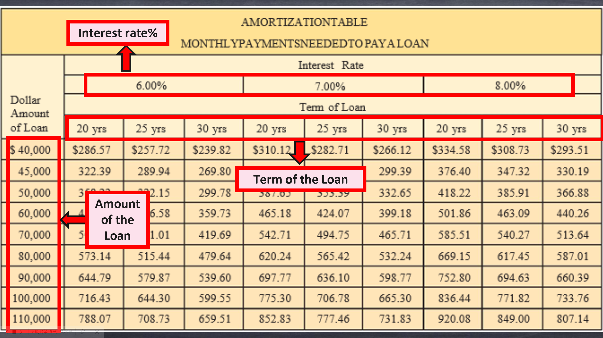

# 6

## 6.1 Mortgage Loan

### 6.1.1 Definitions

-   **Down payment: **a percentage of the total cost of the house paid at the time of purchase.
-   **Mortgage Loan (*principal*):** the money you borrow.
-   **Closing Costs:** fees and taxes paid to complete the purchase.

### 6.1.2 Formulas

- $𝑴𝒐𝒓𝒕𝒈𝒂𝒈𝒆 𝑳𝒐𝒂𝒏=𝑷𝒖𝒓𝒄𝒉𝒂𝒔𝒆 𝑷𝒓𝒊𝒄𝒆 – 𝑫𝒐𝒘𝒏 𝑷𝒂𝒚𝒎𝒆𝒏𝒕$
- $𝑪𝒂𝒔𝒉 𝑵𝒆𝒆𝒅𝒆𝒅 𝒕𝒐 𝑩𝒖𝒚 𝒂 𝑯𝒐𝒎𝒆=𝑫𝒐𝒘𝒏 𝑷𝒂𝒚𝒎𝒆𝒏𝒕+𝑪𝒍𝒐𝒔𝒊𝒏𝒈 𝑪𝒐𝒔𝒕𝒔$

### 6.1.3 Calculations

-   **Interest:**
    -   ​     **Fixed rate mortgages:** The same rate of interest is paid for the life of the loan.
    -   ​    **Variable rate mortgages:** The rate of interest is not guaranteed and may be increased or decreased.
-   **Mortgage Payment: **Most mortgages are repaid gradually over the life of the mortgage in **equal monthly payments**. 

- **Amortization Table:** It is a table that shows the monthly payments needed to amortize mortgage loans over different periods of time using different interest rates.

-   **Refinancing a Mortgage:** 
    When you refinance a mortgage, you take out a new mortgage and use that money to pay off the old mortgage. 

## 6.2 Renting or Owning a Home

-   **Depreciation:** It is the ***loss in*** ***value*** of property caused by aging and use.
-   **Net Cost for a Home:**
    $ Total Expenses – Tax Reductions = Net Cost for the First Year$ 
-   **Costs of Property Rental:** 
    Security deposit is a *one-time* payment in addition to their rent when they sign a lease, or rental agreement. 

## 6.3 Property Taxes

-   **Property taxes** are taxes on the value of real estate such as homes, business property, or farm land.	
    The amount of property tax paid is based on the assessed value of a property.	
-   $Amount to be raised by property tax = Total expense budget – Income from other sources$

-   **Tax Rates in Mills or Cents per Dollar:** $\frac{\$62}{\$1,000}=\frac{\$0.062}{\$1}$

## 6.4 Property Insurance

-   **Homeowners Insurance:** 
    -   A policy that covers your home and protects you against other risks is called ***homeowners*** ***insurance***. 
    -   The amount for which your home is insured is called the ***face value*** of the policy. 
    -   Under ***replacement*** ***cost policies***, the insurance company will pay the cost of replacing your property at current prices. 
    
-   **Premium:** 
    
    The money paid to an insurance company for property insurance is the ***premium***.
    
-   **Renters Insurance Premiums:** 

    If you rent a house or an apartment: You can buy a **renters policy** that provides nearly the same coverage as a homeowners policy except for loss of the dwelling and other structures.
