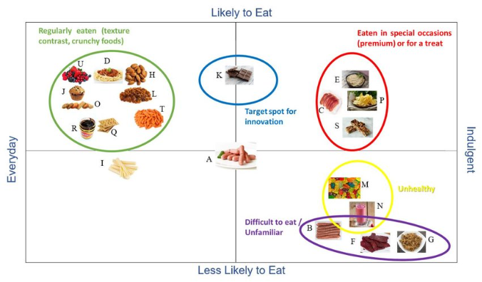

# Chapter 5: Target Markets

目标人群是根据需求划分的、选择目标人群、满足目标的需求

## 5.1 Targeted Marketing versus Mass Marketing

-   **Mass Marketing:** Trying to appeal to *everyone*, like selling plain bubble tea to anyone who walks by.
    -   **Benefit:** You reach a lot of people.
-   **Target Marketing:** Focusing on specific groups of people, like teens or office workers.
    -   **Benefit:** More personalized, making customers feel valued.

## \*5.2 How Markets Are Segmented

### 5.2.0 Definitions

*Market Segmentation* is the process of **dividing a broad market into smaller**, more defined **groups of consumers** with **similar characteristics, needs, or behaviors**.

### 5.2.1 Key Segmentation Bases

-   **Geographic**: 
    Dividing the market by location (e.g., city, region, country).
-   **Demographic**: 
    Based on age, gender, income, occupation, etc.
-   **Psycho-graphic**: 
    Based on lifestyle, values, interests, or attitudes.
-   **Behavioral**: 
    Focused on consumer behavior (e.g., usage, purchasing habits, loyalty).

### 5.2.2 Why segment markets?

-   **Improves Customer Targeting**: 
    Tailoring products and marketing strategies to meet specific customer needs.
-   **Efficient Resource Allocation**: 
    Helps companies spend time and money only on target groups.
-   **Increases Customer Satisfaction and Loyalty**: 
    Meeting specific needs leads to happier customers.

## 5.3 Selecting Target Markets and Target Market Strategies

### 5.3.0 Definitions

-   **Differentiation:**
     Offering **something unique** that sets your product apart from competitors.
-   **Positioning:**
     The way a product is defined by consumers on **key attributes**.

### 5.3.1 **Key Steps** in Differentiation and Positioning Strategy

1.   Identify possible **competitive advantages**.
2.   Choose the **right competitive advantages**.
3.   Select an overall positioning **strategy**.
4.   **Communicate and sustain** the chosen position.

### \*5.3.2 Competitive Advantage

*Competitive Advantage* is an edge gained by **offering greater value** through either:

-   **Competitive Advantage**:  **Lower prices**, OR **Better benefits** that justify higher prices.
-   **Key Differentiation Areas: ** Product, Services, Channels, People, or Image.

A good **difference to promote** must be:

-   **Important**: Solves a key problem.
-   **Distinctive**: Stands out.
-   **Superior**: Better than competitors.
-   **Communicable**: Easy to explain.
-   **Preemptive**: Hard to copy.
-   **Affordable**: Accessible to customers.
-   **Profitable**: Brings long-term gains.

### 5.3.3 Positioning Strategies

*Proposition* is the mix of **benefits** a brand uses to **differentiate itself**.

A **positioning statement** summarizes the company or brand’s position. 

## 5.4 Positioning and Repositioning Offerings

### 5.4.0 Definitions

-   **Positioning** is how people think about a product compared to other similar products.
    It helps a product stand out and look special to customers.
-   **Repositioning** is changing how people think about a product.
    Companies do this to **attract new customers or fit changing needs**.

### 5.4.1 Key Steps

1.   **Analyze the Market**
     Identify key attributes (e.g., price and quality) that customers care about.
2.   **Create a Perceptual Map**
     Plot competitors and locate gaps in the market.
3.   **Develop a Product Strategy**
     Position a new product to fill the market gap.
     Write a catchy tag line that highlights its unique position.

是个例子

