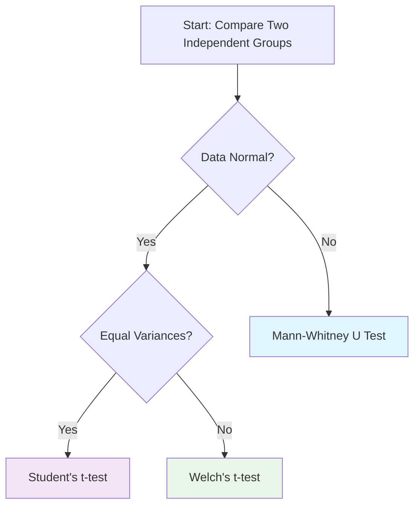

---
Course:
tags:
  - statistics
  - hypothesis-testing
  - t-test
  - welch
  - mann-whitney
  - nonparametric
  - parametric
  - comparison
---
## 1. Overview and Purpose

This systematic note provides a comprehensive comparison of three commonly used statistical tests for comparing two independent groups: Student's t-test, Welch's t-test, and the Mann-Whitney U test. Each test serves different purposes and has specific assumptions and applications.

## 2. Quick Reference Table

| Test | Type | Key Assumptions | When to Use | Effect Size |
|------|------|----------------|-------------|-------------|
| **Student's t-test** | Parametric | Normality, equal variances, independence | Normal data with equal variances | Cohen's d |
| **Welch's t-test** | Parametric | Normality, independence | Normal data with unequal variances | Cohen's d |
| **Mann-Whitney U** | Nonparametric | Independence, ordinal/continuous data | Non-normal data, ordinal data | Rank-biserial correlation |

## 3. Detailed Test Characteristics

### 3.1. Student's t-test (Independent Samples)

**Definition**: A parametric test comparing means of two independent groups assuming equal population variances.

**Test Statistic**:
$$
t = \frac{\bar{X}_1 - \bar{X}_2}{s_p \sqrt{\frac{1}{n_1} + \frac{1}{n_2}}}
$$

Where:

- $\bar{X}_1$, $\bar{X}_2$ = sample means
- $n_1$, $n_2$ = sample sizes
- $s_p$ = pooled standard deviation

**Pooled Standard Deviation**:
$$
s_p = \sqrt{\frac{(n_1-1)s_1^2 + (n_2-1)s_2^2}{n_1 + n_2 - 2}}
$$

**Degrees of Freedom**:
$$
df = n_1 + n_2 - 2
$$

**Key Assumptions**:

1. **Normality**: Data in each group are normally distributed
2. **Homogeneity of variances**: Population variances are equal
3. **Independence**: Observations are independent
4. **Interval/ratio scale**: Data are continuous

**R Implementation**:
```R
# Student's t-test (equal variances assumed)
result <- t.test(group1, group2, var.equal = TRUE)

# With formula interface
result <- t.test(score ~ group, data = dataset, var.equal = TRUE)
```

### 3.2. Welch's t-test

**Definition**: A parametric test comparing means without assuming equal variances between groups.

**Test Statistic**:
$$
t = \frac{\bar{X}_1 - \bar{X}_2}{\sqrt{\frac{s_1^2}{n_1} + \frac{s_2^2}{n_2}}}
$$

**Degrees of Freedom** (Welch-Satterthwaite equation):
$$
df = \frac{\left(\frac{s_1^2}{n_1} + \frac{s_2^2}{n_2}\right)^2}{\frac{(s_1^2/n_1)^2}{n_1-1} + \frac{(s_2^2/n_2)^2}{n_2-1}}
$$

**Key Assumptions**:

1. **Normality**: Data in each group are normally distributed
2. **Independence**: Observations are independent
3. **Interval/ratio scale**: Data are continuous
4. **Unequal variances allowed**: No homogeneity of variances assumption

**R Implementation**:
```R
# Welch's t-test (default in R)
result <- t.test(group1, group2, var.equal = FALSE)

# Explicit specification
result <- t.test(group1, group2)

# With formula interface
result <- t.test(score ~ group, data = dataset)
```

### 3.3. Mann-Whitney U Test (Wilcoxon Rank-Sum Test)

**Definition**: A nonparametric test determining if one group tends to have larger values than another.

**Test Procedure**:

1. Combine all observations from both groups
2. Rank them from smallest to largest
3. Calculate U statistics:
   - $U_1 = R_1 - \frac{n_1(n_1+1)}{2}$
   - $U_2 = R_2 - \frac{n_2(n_2+1)}{2}$
4. Test statistic: $U = \min(U_1, U_2)$

**Key Assumptions**:

1. **Independence**: Observations are independent
2. **Ordinal/continuous data**: Data can be ranked
3. **Similar shape distributions**: For location shift interpretation
4. **No normality assumption**: Distribution-free

**R Implementation**:

```R
# Mann-Whitney U test
result <- wilcox.test(group1, group2)

# With formula interface
result <- wilcox.test(score ~ group, data = dataset)

# Extract results
U_statistic <- result$statistic
p_value <- result$p.value
```

## 4. Decision Framework

### 4.1. Test Selection Algorithm



### 4.2. Detailed Selection Criteria

| Scenario | Recommended Test | Rationale |
|----------|-----------------|-----------|
| **Normal data, equal variances** | Student's t-test | Maximizes power when assumptions met |
| **Normal data, unequal variances** | Welch's t-test | Robust to variance heterogeneity |
| **Non-normal data** | Mann-Whitney U test | Distribution-free, handles outliers |
| **Ordinal data** | Mann-Whitney U test | Designed for ranked data |
| **Small samples** | Mann-Whitney U test | Less sensitive to distribution |
| **Unequal sample sizes** | Welch's t-test | Handles unequal n better |
| **Default choice** | Welch's t-test | More robust, recommended by many statisticians |

## 5. Assumption Checking Procedures

### 5.1. Normality Testing

**Shapiro-Wilk Test**:

```R
# Test normality for each group
shapiro.test(group1)
shapiro.test(group2)
```

**Visual Inspection**:

- Q-Q plots
- Histograms
- Density plots

### 5.2. Homogeneity of Variances

**Levene's Test**:

```R
library(car)
leveneTest(score ~ group, data = dataset)
```

**F-test**:

```R
var.test(group1, group2)
```

**Bartlett's Test**:

```R
bartlett.test(score ~ group, data = dataset)
```

### 5.3. Independence

- Research design consideration
- No statistical test available
- Ensure random sampling and assignment

## 6. Effect Size Measures

### 6.1. For Parametric Tests (Student's and Welch's t-tests)

**Cohen's d**:
$$
d = \frac{\bar{X}_1 - \bar{X}_2}{s_{pooled}}
$$

Where:
$$
s_{pooled} = \sqrt{\frac{(n_1-1)s_1^2 + (n_2-1)s_2^2}{n_1+n_2-2}}
$$

**Interpretation**:

- Small: $d = 0.2$
- Medium: $d = 0.5$
- Large: $d = 0.8$

### 6.2. For Mann-Whitney U Test

**Rank-biserial correlation**:
$$
r = 1 - \frac{2U}{n_1n_2}
$$

**Common language effect size**:

- Probability that random observation from group 1 > group 2
- $CL = \frac{U}{n_1n_2}$

## 7. Practical Examples

### 7.1. Example 1: Student's t-test

**Scenario**: Comparing exam scores between two classes with similar variance.

```R
# Data
class_A <- c(78, 82, 85, 76, 79, 81, 83, 77, 80, 84)
class_B <- c(75, 78, 72, 79, 76, 74, 77, 73, 75, 78)

# Assumption checking
shapiro.test(class_A)  # p = 0.423 (normal)
shapiro.test(class_B)  # p = 0.356 (normal)
var.test(class_A, class_B)  # p = 0.218 (equal variances)

# Student's t-test
t.test(class_A, class_B, var.equal = TRUE)
```

### 7.2. Example 2: Welch's t-test

**Scenario**: Comparing reaction times between two age groups with different variances.

```R
# Data
young <- c(210, 195, 225, 240, 205, 215, 230, 220, 200, 210)
elderly <- c(280, 295, 270, 310, 320, 290, 300, 285, 315, 305)

# Assumption checking
shapiro.test(young)    # p = 0.512 (normal)
shapiro.test(elderly)  # p = 0.487 (normal)
var.test(young, elderly)  # p = 0.023 (unequal variances)

# Welch's t-test
t.test(young, elderly)  # var.equal = FALSE by default
```

### 7.3. Example 3: Mann-Whitney U Test

**Scenario**: Comparing customer satisfaction ratings (ordinal scale 1-5).

```R
# Data
store_A <- c(4, 3, 5, 2, 4, 3, 5, 4, 3, 4)
store_B <- c(3, 2, 3, 1, 2, 3, 2, 1, 3, 2)

# Mann-Whitney U test
wilcox.test(store_A, store_B)
```

## 8. Power and Sample Size Considerations

### 8.1. Relative Power

- **Student's t-test**: Most powerful when assumptions are perfectly met
- **Welch's t-test**: Slightly less power than Student's when variances equal, but better Type I error control
- **Mann-Whitney U**: About 95% as powerful as t-tests for normal data, often more powerful for non-normal data

### 8.2. Sample Size Guidelines

| Test | Minimum Sample Size | Recommended per Group |
|------|---------------------|----------------------|
| Student's t-test | 15-20 | 30+ |
| Welch's t-test | 15-20 | 30+ |
| Mann-Whitney U | 5-10 | 20+ |

## 9. Common Pitfalls and Best Practices

### 9.1. Common Mistakes

1. **Using Student's t-test without checking variances**
2. **Applying parametric tests to non-normal data**
3. **Ignoring effect sizes**
4. **Not reporting assumption checks**
5. **Using multiple tests without correction**

### 9.2. Best Practices

1. **Always check assumptions first**
2. **Use Welch's t-test as default for parametric comparisons**
3. **Report both p-values and effect sizes**
4. **Use visualizations to support statistical findings**
5. **Consider the research question when choosing tests**

## 10. Advanced Considerations

### 10.1. Transformations

When data violate normality assumptions:

- **Log transformation**: For right-skewed data
- **Square root transformation**: For count data
- **Arcsin transformation**: For proportions

### 10.2. Robust Alternatives

- **Trimmed means**: Remove extreme values
- **Bootstrap methods**: Resampling approaches
- **Permutation tests**: Exact nonparametric tests

### 10.3. Software Implementation

**Python**:
```python
from scipy import stats
# Student's t-test
stats.ttest_ind(group1, group2, equal_var=True)
# Welch's t-test
stats.ttest_ind(group1, group2, equal_var=False)
# Mann-Whitney U test
stats.mannwhitneyu(group1, group2)
```

## 11. Summary and Recommendations

### 11.1. Key Takeaways

1. **Student's t-test**: Use only when normality and equal variances are confirmed
2. **Welch's t-test**: Recommended default for parametric comparisons
3. **Mann-Whitney U**: Go-to choice for non-normal or ordinal data
4. **Always validate assumptions** before test selection
5. **Report comprehensive results** including effect sizes and assumption checks

### 11.2. Final Decision Matrix

| Data Characteristic | Preferred Test |
|---------------------|----------------|
| Normal + equal variances | Student's t-test |
| Normal + unequal variances | Welch's t-test |
| Non-normal data | Mann-Whitney U test |
| Ordinal data | Mann-Whitney U test |
| Small samples | Mann-Whitney U test |
| Default choice | Welch's t-test |

### 11.3. Related Tests

- **Paired t-test**: For dependent samples
- **One-way ANOVA**: For comparing >2 groups
- **Kruskal-Wallis test**: Nonparametric alternative to ANOVA
- **Bootstrapping**: For complex data situations
